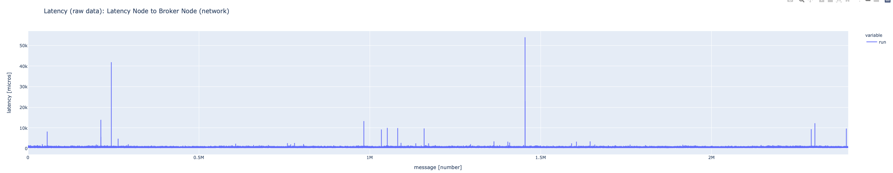

# Use Case Performance Tests for Solace PubSub+ Brokers

Performance tests for Solace PubSub+ Brokers in Azure & AWS based on use case specific setup.

[Release Notes](./ReleaseNotes.md) |
[Report Issues](https://github.com/solace-iot-team/az-use-case-perf-tests/issues).

<table style="width:100%">
  <tr>
    <td>

</td>
    <td>

</td>
  </tr>
</table>

## Setup Controller

  The project requires a controller running tools such as Terraform and Ansible.

  - [Setup Instructions for Azure Controller VM](./infrastructure/controller/azure).

## Use Cases

  - [Market Data Distribution (non-persistent)](./uc-non-persistent).

---
The End.
