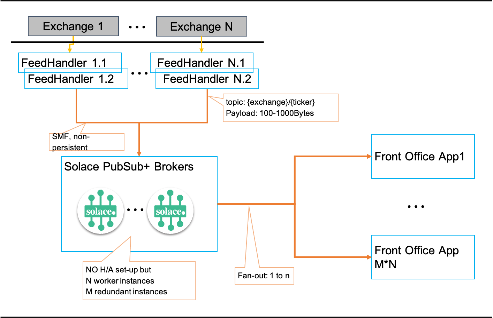
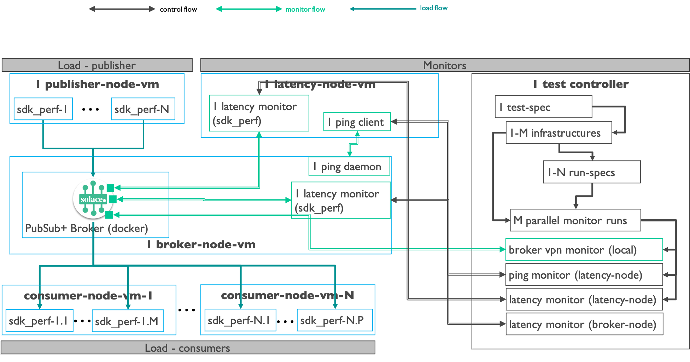

# Overview MDD: Use Case & Test Framework

## Architecture

The following figure describes the architecture concepts used as the basis for the test framework set-up and the test run-specifications.

**Characteristics:**

* Non-Persistent messaging
  - does not require H/A setup
  - fail-over happens at the client API level
* Message Sizes
  - 100, 200, 500, 1000 bytes
* Number of Topics
  - Each instrument from exchange = 1 topic
  - Range: 500K – 1m topics per exchange
* Front-Office apps
  - Subscribe to a sub-set of instrumentsacross all exchanges
  - Fan-out ratios: 1:8, 1:20, 1:50
* Latency
  - from feedhandler to front office app
  - percentiles: mean, 90th, 95th, 99th, 99.9th, max
* Condition
  - Zero message loss

## Test Framework

Overview:

**Characteristics**
* Infrastructures
  - standup 1-N infrastructures (supported clouds: AZURE & AWS)
    - each one with different number and size of virtual machines
* Separation of Load and Monitors
  - Load:
    - simulate feedhandlers and front office apps
    - create a continuous load on the system
  - Monitors:
    - probes that periodically take sample metrics from the system under load
    - sample duration: between 25 seconds and 100 seconds
    - probing frequency: between 45 seconds and 120 seconds
* Load:
  - 1 publisher virtual machine (vm)
    - running 1-N publishers simulated using [Solace SDKPerf Tool](https://solace.com/products/performance/).
  - N consumer vms
    - each vm running 1-N consumers simulated using [Solace SDKPerf Tool](https://solace.com/products/performance/).
  - Fan-out / subscriptions
    - publishers: configurable topics and number of topics
    - consumers: configurable subscriptions to topics including wildcards
    - fan-out: determined by the topic from publishers / topic subscriptions
* Latency VM
  - 1 latency vm with SDKPerf and PING client
  - SDKPerf:
    - acts as publisher & consumer
    - send & receives messages at configurable rate with configurable size payload
    - measures round-trip time of each message
  - PING client:
    - measures round-trip time of a ping message to the Broker node
* Test Controller
  - separate VM running the tests
  - test specification driven ([template](../tests/auto-run/template.{spec-id}.test.spec.yml))
    - configurable number of infrastructures
    - configurable number of runs
      - each run with different parameters as per spec
  - Ansible playbook control the test runs and orchestrate metrics gathering
  - Broker VPN Monitor
    - uses SEMP to gather statistics & metrics directly from the PubSub+ Broker
  - Latency Monitor (latency node)
    - starts / stops SDKPerf on the latency VM and retrieves rtt latency for every message sent
  - Latency Monitor (broker node)
    - starts / stops SDKPPerf on the broker VM and retrieves rtt latency for every message sent
  - Ping Monitor
    - starts / stops ping client on latency VM and retrieves rtt stats provided by ping client

---
The End.
